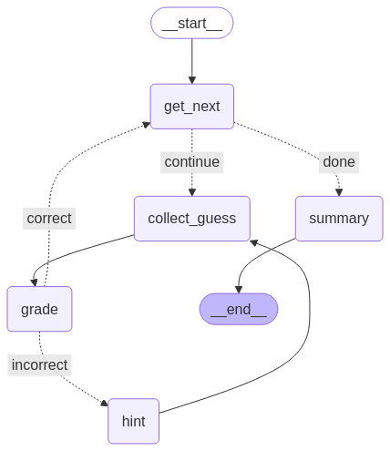
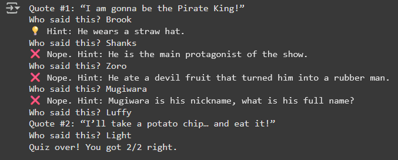

# LangGraph Anime Quote Trivia Agent

A self-contained Anime Quote Trivia Agent built with LangGraph and Google Gemini API. It quizzes you on famous anime quotes, provides hints if you're stuck, and summarizes your performance at the end.

## Features

*   Interactive quiz session in the terminal.
*   Presents anime quotes one by one.
*   Collects user guesses.
*   Grades answers (potentially using LLM for fuzzy matching, depending on implementation in `handlers.py`).
*   Offers hints upon request.
*   Provides a final summary of correct/incorrect answers.
*   Uses LangGraph to manage the conversation flow and state.
*   Integrates with Google Gemini API (likely for grading or hint generation).

## Project Structure

```
Quiz_AIAgent_LangGraph/
├── .env.example          # Template for environment variables (e.g. GOOGLE_API_KEY)
├── .gitignore            # Files and directories ignored by Git
├── README.md             # This file
├── requirements.txt      # Python dependencies
├── quizzes.py            # Contains the quiz questions, answers, and helper functions
├── state.py              # Defines the Pydantic model for the graph's state (`QuoteQuizState`)
├── handlers.py           # Implements the logic for each node (step) in the quiz graph
├── graph.py              # Constructs the LangGraph StateGraph and defines node/edge connections
└── main.py               # Entry point: Sets up environment, compiles the graph, and runs the quiz
```

## Setup and Installation

1.  **Clone the repository (if you haven't already):**
    ```bash
    git clone <repository-url>
    cd Quiz_AIAgent_LangGraph
    ```

2.  **Create and activate a virtual environment:**
    ```bash
    # Windows
    python -m venv venv
    .\venv\Scripts\activate

    # macOS/Linux
    python3 -m venv venv
    source venv/bin/activate
    ```

3.  **Install dependencies:**
    ```bash
    pip install -r requirements.txt
    ```

4.  **Set up environment variables:**
    *   Copy the example environment file:
        ```bash
        # Windows
        copy .env.example .env

        # macOS/Linux
        cp .env.example .env
        ```
    *   Edit the `.env` file and add your Google API Key:
        ```
        GOOGLE_API_KEY="YOUR_API_KEY_HERE"
        ```

## How to Run

Execute the main script from the `Quiz_AIAgent_LangGraph` directory:

```bash
python main.py
```

This will start the interactive quiz in your terminal.

## Flow Diagram

Below is the visual flow of the agent’s state graph:



## Sample Run

Here’s a screenshot of a sample run in the terminal:



## How it Works

The application uses LangGraph to define the flow of the quiz as a state machine:

1.  **State (`state.py`):** A `QuoteQuizState` object (likely a Pydantic model or TypedDict) holds all the information passed between steps, such as the list of quizzes, the current question index, user guesses, scores, and hints used.
2.  **Handlers (`handlers.py`):** Each Python function in this file represents a node in the graph. These functions perform specific actions like selecting the next question (`get_next`), prompting the user (`collect_guess`), checking the answer (`grade`), providing a hint (`hint`), or generating the final summary (`summary`).
3.  **Graph (`graph.py`):** This script builds the `StateGraph`, adds the handler functions as nodes, and defines the edges (transitions) between them based on the current state or the outcome of a node (e.g., if the answer is correct, go to the next question; if incorrect, offer a hint or grade).
4.  **Main (`main.py`):** This script initializes everything, compiles the graph into a runnable LangChain object, and invokes it to start the quiz loop.

## Dependencies

*   LangChain / LangGraph
*   Google Generative AI SDK (`google-generativeai`)
*   Python-dotenv (for loading environment variables)
*   (Check `requirements.txt` for the full list and specific versions)

